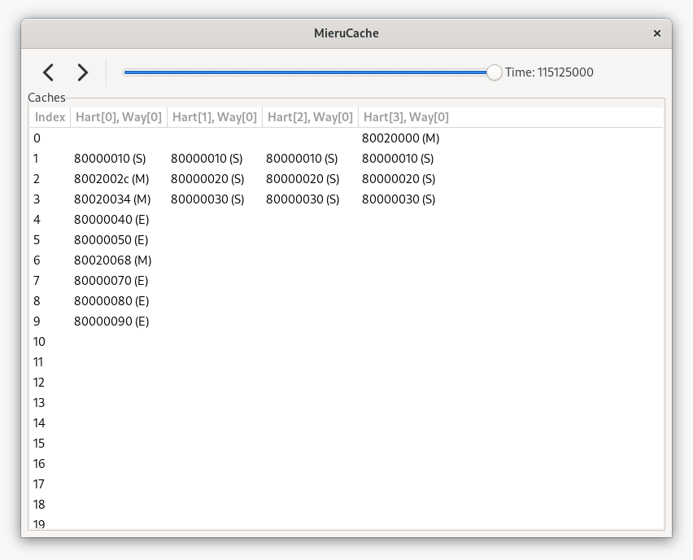

# MieruCache

## Usage

Install `gtkmm-3.0-dev` via `apt` or something beforehand.

Clone this project and move into the cloned directory.
Then, type the following commands:

```
make
./build/mierucache example/example_delayed.txt
```

The expected result is as follows:



You can see cache state for each entry and occupying address, those are for the time you selected with the arrows or the bar on the top of the window.
The event that occurred at the shown time is also displayed at the bottom of the window like:
```
Event: Hart[3], Initiator[3], Address[8002af38], Old State[M], New State[M]
```

### Format

Currently, MieruCache accepts text files with the following format:

```c++
// configurations
num_harts num_entries num_ways initial_time
// initial cache state for each cores (harts)
hart_id
initial_address[hart_id][0]    initial_state[hart_id][0]
initial_address[hart_id][1]    initial_state[hart_id][1]
...
// events
time    target_hart_id    initiator_hart_id    index    address    old_state    new_state
...
```

Please visit the [`example`](example) directory.

## TODO

- [X] Implement a simple parser.
- [X] Implement GUI.
- [ ] Improve GUI.
	- [x] Highlight the changing cache lines.
	- [ ] Show the cache occupancy.
- [ ] Enable multiple ways for set-associative and full-associative.
- [ ] Detect the illegal state.
