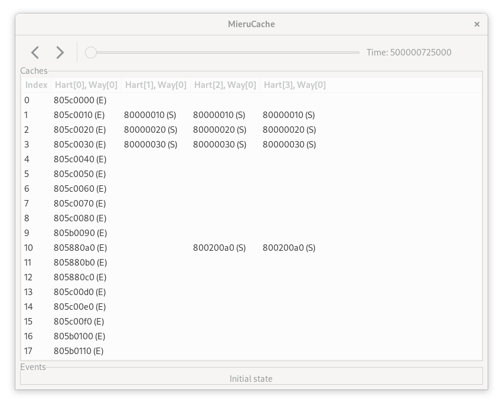

# MieruCache

## Usage

Install `gtkmm-3.0-dev` via `apt` or something beforehand.

Clone this project and move into the cloned directory.
Then, type the following commands:

```
make
./build/mierucache example/example.txt
```

The expected result is as follows:



### Format

Currently, MieruCache accepts text files with the following format:

```
num_harts num_entries	num_ways
time hart_id initiator_id index address old_state new_state
...
```

Please visit `example` directory.

## TODO

- [X] Implement a simple parser.
- [X] Implement GUI.
- [ ] Improve GUI.
	- [ ] Highlight the changing cache lines.
